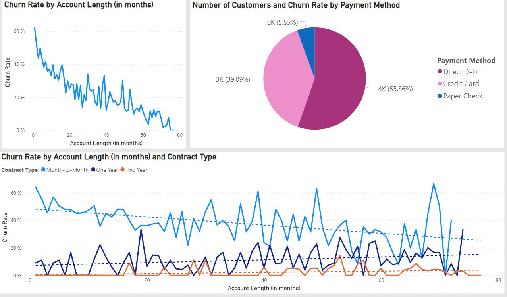

# Power_BI_Telecom_churn
Power BI reports on Telecom churn ratio

Actionable Insights from the Power BI Reports on Telecom Subscription Churn:
Churn Rate and Account Length:

There is a clear negative correlation between churn rate and account length. Customers with longer account lengths tend to have lower churn rates.
Actionable Insight: Develop loyalty programs that reward long-term customers and encourage newer customers to stay longer, possibly offering incentives or benefits for staying past critical churn-prone periods (such as within the first 20 months).
Demographics and Churn:

Older customers tend to churn less, whereas younger customers under 30 have higher churn rates.
Actionable Insight: Focus retention efforts on younger customer segments by addressing their unique needs, offering flexible plans, and more personalized support.
Churn Reasons:

The top reasons for churn are competitor offers and dissatisfaction with service/support.
Actionable Insight: Improve service quality, customer support, and competitive pricing strategies. A proactive approach to customer service issues may reduce churn, and creating compelling offers can neutralize competitor appeal.
Contract Type:

Monthly contracts exhibit a much higher churn rate compared to yearly contracts.
Actionable Insight: Promote longer-term contracts by offering discounts or incentives for switching from monthly to yearly plans. Providing more clarity on the benefits of yearly plans could reduce the monthly contract churn rate.
Payment Methods and Churn:

Payment methods also influence churn, with “Paper Check” users having a higher churn rate compared to other payment methods like direct debit or credit card.
Actionable Insight: Encourage customers to switch to more secure and convenient payment methods like direct debit by offering discounts or incentives.
Unlimited Data Plan:

Customers with unlimited data plans tend to have a higher churn rate, particularly those who consume large amounts of data.
Actionable Insight: Investigate if the pricing or perceived value of unlimited data plans is a factor in churn. Consider revising the plans or offering better data management tools to customers.
Churn by Usage:

Customers who consume less data or fewer minutes generally churn less compared to heavy users.
Actionable Insight: Create personalized offers for heavy users based on their usage patterns, including targeted promotions or customized data/minute bundles.
Geographical Insights:

Certain geographical areas show higher churn rates.
Actionable Insight: Focus marketing and retention efforts on high-churn regions with localized offers, and ensure service reliability and customer satisfaction in those areas.
By addressing these insights with targeted retention strategies, telecom companies can reduce churn and improve customer satisfaction.
